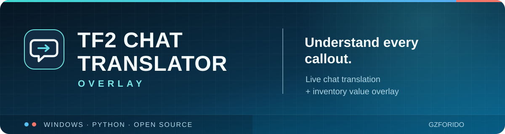
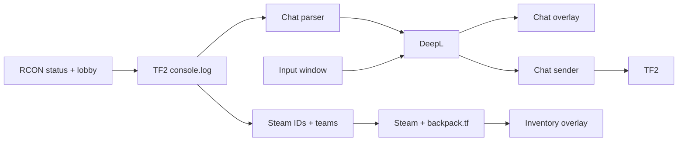

<p align="center">
  
</p>

<p align="center">
  <a href="#features">Features</a> ·
  <a href="#quick-start">Quick start</a> ·
  <a href="#how-it-works">How it works</a> ·
  <a href="#configuration-and-security">Configuration</a> ·
  <a href="#license">License</a>
</p>

<p align="center">
  
  
  
  <a href="LICENSE"></a>
</p>

<p align="center">
  <strong>Перевод чата Team Fortress 2 поверх игры — без переключения окон.</strong><br />
  Чат, обратный перевод и оценка инвентарей в двух компактных оверлеях для Windows.
</p>

> [!NOTE]
> Для перевода нужен **собственный ключ DeepL API**. Инвентари — дополнительная функция: для неё нужны ключи Steam Web API и backpack.tf. Проект не связан с Valve или этими сервисами.

## Features

| Возможность | Что делает |
| --- | --- |
| **Live chat translation** | Читает новые сообщения из `tf/console.log`, переводит через DeepL и показывает оригинал вместе с переводом. |
| **Reverse translation** | Переводит ваш текст перед отправкой в общий или командный чат. В окне можно выбрать RU / EN / ZH и скопировать исходный либо переведённый текст. |
| **Inventory values** | Показывает оценки инвентарей игроков в USD (C/S), когда доступны данные Steam и backpack.tf. Есть фильтр команды и минимальной цены. |
| **Overlay controls** | Оверлеи пропускают клики по умолчанию; положение и размер можно менять, а при уходе из TF2 они скрываются. |

## Quick start

1. Установите **Python 3.11+** на Windows 10/11. Скачайте проект ZIP-архивом через зелёную кнопку **Code** или клонируйте:

   ```powershell
   git clone https://github.com/Gzforido/tf2-chat-translator-overlay.git
   cd tf2-chat-translator-overlay
   ```

2. Добавьте в параметры запуска TF2 в Steam флаги `-condebug -usercon`. Они нужны для `console.log` и клиентского RCON.
3. Запустите [`setup_api.bat`](setup_api.bat). Он покажет официальные страницы получения ключей и сохранит введённые значения в локальный `config.json`. Достаточно ключа DeepL, если нужны только переводы чата.
4. Если TF2 установлена в другом месте, укажите путь к `tf/console.log` в `log_path` созданного `config.json`.
5. Запустите [`run.bat`](run.bat). При необходимости он установит зависимости и запустит приложение.

Официальные страницы ключей: [DeepL API](https://www.deepl.com/en/developers) · [Steam Web API](https://steamcommunity.com/dev/apikey) · [backpack.tf](https://next.backpack.tf/account/api-access).

## Controls

| Клавиша | Действие |
| --- | --- |
| `Insert` | Включить или выключить перемещение и изменение размеров оверлеев. |
| `Home` | Открыть или закрыть окно обратного перевода. |
| `Scroll Lock` | Переключить общий и командный чат. |

В окне инвентарей можно выбрать **Все / Союзники / Противники** и минимальную цену. Если команда игрока не определена по данным текущего матча, он не попадёт в фильтры союзников и противников. Горячие клавиши и параметры оверлеев меняются в `config.json`.

## How it works



Чат читается из лог-файла; запросы перевода выполняются в фоновых потоках. Инвентарный блок отдельно получает игроков через клиентский RCON и оценивает доступные инвентари. Если API недоступен или инвентарь приватный, значение может отсутствовать — это не означает нулевую стоимость.

## Configuration and security

Полный шаблон настроек — [`config.example.json`](config.example.json). Скрипт [`setup_api.bat`](setup_api.bat) принимает ключи со скрытым вводом и сохраняет их только в локальный `config.json`, который исключён из Git через [`.gitignore`](.gitignore). При первой настройке также создаётся отдельный случайный пароль RCON. Параметры запуска Steam/TF2 могут хранить этот пароль локально вне репозитория.

**Не добавляйте** в коммиты `config.json`, игровые логи, `localconfig.vdf` и бэкапы. Если ключ уже был опубликован, отзовите его на сайте сервиса и получите новый. Перед отправкой изменений проверяйте `git status` и список файлов коммита.

## Development and build

Стек: Python 3.11+, PyQt6 6.4+, DeepL SDK, langdetect, pynput. Проверка исходников:

```powershell
python -m pip install -r requirements.txt
python -m unittest discover -s tests -v
python -m compileall -q main.py core ui utils tests
```

Для сборки одного Windows EXE запустите [`build_exe.bat`](build_exe.bat). Он создаёт `dist/TF2ChatTranslator.exe` и **не упаковывает ключи**. Для запуска EXE нужен отдельный `dist/config.json`, созданный по примеру `dist/config.example.json`. Не публикуйте `dist/` вместе со своими настройками.

## Limitations

- Оверлей рассчитан на оконный или безрамочный режим TF2; эксклюзивный полноэкранный режим может его скрывать.
- Отправка сообщения симулирует клавиатуру в активном окне. Перед Enter убедитесь, что TF2 в фокусе.
- Оценки инвентарей зависят от Steam, backpack.tf и приватности профиля. Это ориентир, а не гарантированная цена продажи; HTML-парсер может перестать работать после изменений сайта.
- Скрипт настройки TF2 может изменить локальные параметры запуска Steam и `autoexec.cfg`. Если используете собственную конфигурацию игры, проверьте эти файлы.

## Contributing

Нашли ошибку или хотите улучшить проект? Откройте [issue](https://github.com/Gzforido/tf2-chat-translator-overlay/issues) или предложите pull request. Для изменений, затрагивающих ключи и логи, не прикладывайте реальные секреты и личные данные игроков.

## License

[MIT](LICENSE) © 2026 [Gzforido](https://github.com/Gzforido). Team Fortress 2, Steam, DeepL и backpack.tf принадлежат их владельцам; этот проект не является официальным продуктом этих сервисов.
